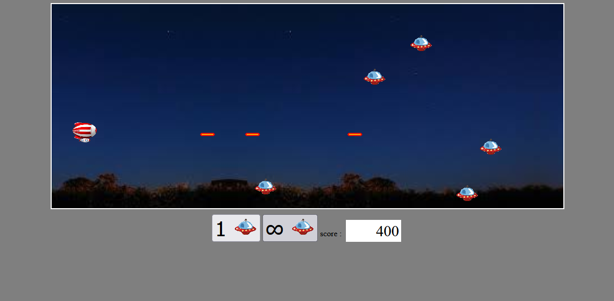

# ***Starship Game***

A JavaScript-based space shooter game built with HTML5 Canvas and Webpack. Control your starship to shoot down flying saucers.



## Game Features

- **Smooth Controls**: Use arrow keys to move your starship up and down
- **Dynamic Shooting**: Press spacebar to fire projectiles at enemy saucers
- **Score System**: Earn 200 points for each hit, lose 1000 points if a saucer escapes
- **Collision Detection**: Realistic bounding box collision detection
- **Auto-spawn Mode**: Toggle automatic enemy spawning

## Technologies Used

- **JavaScript (ES6+)**: Modern JavaScript with classes and modules
- **HTML5 Canvas**: For rendering game graphics
- **Webpack**: Module bundler for development and production builds
- **npm**: Package management

## Prerequisites

- Node.js (v12 or higher)
- npm (v6 or higher)

## Quick Start

### Using Make (Recommended)
```bash
# Install dependencies
make install

# Start development server
make dev

# Build for production
make build

# Build and open in browser
make run

# Fix security vulnerabilities
make audit
```

### Using npm directly
```bash
# Install dependencies
npm install

# Start development server (recommended for development)
npm run dev-server

# Build for production
npm run build

# Open the game
./dist/index.html
```

## How to Play

1. **Move**: Use `↑` and `↓` arrow keys to move your starship
2. **Shoot**: Press `Spacebar` to fire projectiles
3. **Score**: Hit saucers to earn points (+200 per hit)
4. **Avoid**: Don't let saucers escape off the left side (-1000 points)

### Game Controls

| Key | Action |
|-----|--------|
| `↑` | Move Up |
| `↓` | Move Down |
| `Space` | Fire |

### Buttons

- **Add Saucer**: Manually spawn a new enemy saucer
- **Toggle Auto-spawn**: Enable/disable automatic saucer spawning

## Project Structure
```
tstarship-shooter/
├── src/
│   ├── scripts/
│   │   ├── game.js           # Main game logic
│   │   ├── main.js           # Entry point
│   │   ├── mobile.js         # Base class for moving objects
│   │   ├── starShip.js       # Player's starship
│   │   ├── saucer.js         # Enemy saucers
│   │   ├── shoot.js          # Projectiles
│   │   ├── keyManager.js     # Keyboard input handler
│   │   └── assets/
│   │       └── images/       # Game sprites
│   ├── style/
│   │   └── style.css         # Game styling
│   └── index.html            # HTML template
├── dist/                     # Built files (generated)
├── webpack.config.js         # Webpack configuration
├── package.json              # Project dependencies
├── Makefile                  # Build automation
├── README.md                 # This file
└── screanshots/
    └── gameplay.png          # Game screenshot
```

## Development

The project uses Webpack's development server with hot reloading:
```bash
make dev
```

Visit `http://localhost:8080` to see your changes in real-time.

## Build

To create a production build:
```bash
make build
```

The optimized files will be in the `dist/` directory.

## Clean

To remove generated files:
```bash
make clean
```

## Academic Context

This project was developed as part of a university assignment (L2 S4 - JavaScript course) and has been refactored for portfolio presentation.

**Original Assignment**: TP 3 - Starship Project  
**Course**: JavaScript - S4  
**University**: Université de Lille

## Security

To check and fix npm package vulnerabilities:
```bash
make audit
```

## License

This project is for educational purposes.


## Author

**Sidjil Merzouki**

- GitHub: [Sidjil-MERZOUKI](https://github.com/Sidjil-MERZOUKI)
- LinkedIn: [Sidjil Merzouki](https://linkedin.com/in/jean-dupont)

---

**Note**: Generated directories (`dist/`, `node_modules/`) are excluded from version control and can be regenerated from source files.